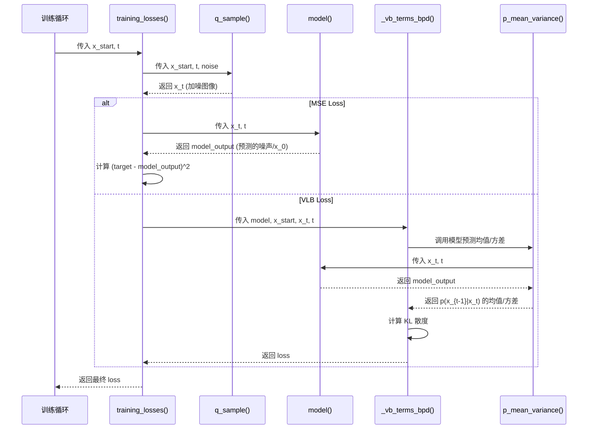
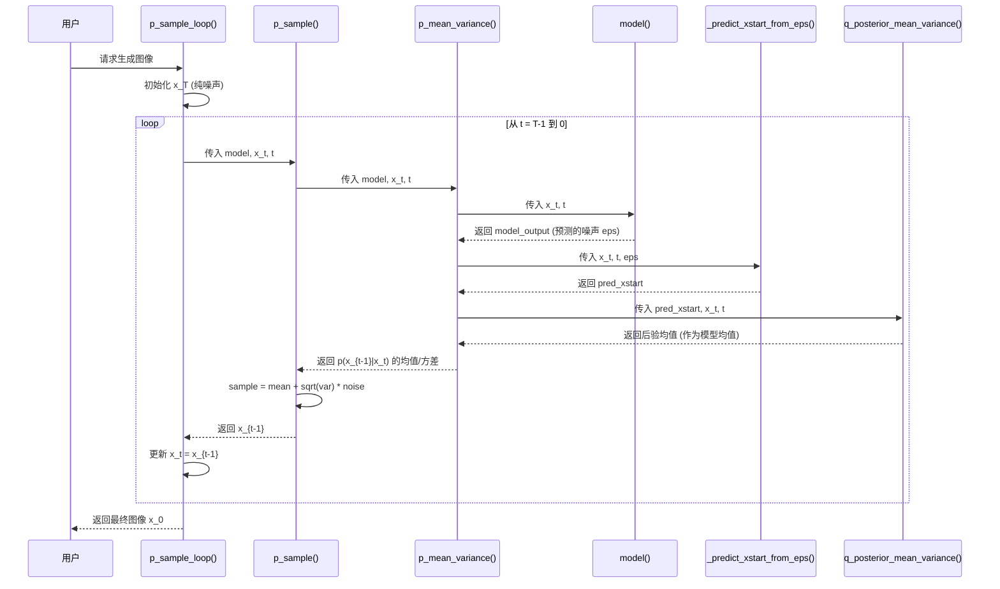

# `gaussian_diffusion.py` 核心函数分析

本文档详细分析了 `guided_diffusion/gaussian_diffusion.py` 文件中核心函数之间的联系、调用关系和数据流。

## 1. 核心函数分类

`gaussian_diffusion.py` 中的函数可以根据其在扩散模型中的作用分为以下几类：

### 前向扩散过程 (q-functions)

这些函数定义了从原始数据 `x_0` 到加噪数据 `x_t` 的过程，即 `q(x_t | x_0)`。这是一个固定的、无参数的马尔可夫过程。

- **`q_mean_variance(x_start, t)`**: 根据初始图像 `x_0` 和时间步 `t`，计算 `q(x_t | x_0)` 分布的均值 `sqrt(alpha_bar_t) * x_0` 和方差 `(1 - alpha_bar_t) * I`。
- **`q_sample(x_start, t, noise)`**: 从 `q(x_t | x_0)` 中采样得到加噪图像 `x_t`。它使用重参数化技巧：`x_t = sqrt(alpha_bar_t) * x_0 + sqrt(1 - alpha_bar_t) * noise`。这是训练过程的入口。
- **`q_posterior_mean_variance(x_start, x_t, t)`**: 计算后验分布 `q(x_{t-1} | x_t, x_0)` 的均值和方差。这个后验分布是可解的，其均值和方差是计算 VLB 损失和模型均值的关键。

### 反向去噪过程 (p-functions)

这些函数定义了从噪声 `x_T` 逐步去噪到 `x_0` 的过程，即 `p(x_{t-1} | x_t)`。这个过程由一个神经网络（通常是 UNet）来近似。

- **`p_mean_variance(model, x, t, ...)`**: 这是反向过程的核心。它调用神经网络 `model` 来预测 `x_{t-1}` 的均值和方差。根据 `model_mean_type`，模型可以预测噪声 `epsilon`、`x_0` 或 `x_{t-1}` 本身。最常见的是预测噪声，然后用它来计算 `x_0` 的预测值 `pred_xstart`，最后通过 `q_posterior_mean_variance` 计算出 `x_{t-1}` 的均值。
- **`p_sample(model, x, t, ...)`**: 从 `p(x_{t-1} | x_t)` 中采样得到 `x_{t-1}`。它首先调用 `p_mean_variance` 获得均值和方差，然后加上一个高斯噪声进行采样。
- **`p_sample_loop(model, shape, ...)`**: 完整的 DDPM 采样循环。它从一个纯高斯噪声 `x_T` 开始，反复调用 `p_sample` 从 `t=T-1` 到 `0` 进行迭代，最终生成 `x_0`。

### DDIM 采样函数

DDIM 是一种更快的采样方法，它通过修改生成过程的方差，使其成为一个确定性过程（当 `eta=0` 时）。

- **`ddim_sample(model, x, t, ..., eta)`**: DDIM 的单步采样函数。它也调用 `p_mean_variance` 来获取 `pred_xstart` 和 `eps`，但使用不同的公式来计算 `x_{t-1}`，引入了 `eta` 参数来控制随机性。
- **`ddim_sample_loop(model, shape, ..., eta)`**: 完整的 DDIM 采样循环，反复调用 `ddim_sample` 来生成图像。

### 训练相关函数

这些函数用于计算训练过程中的损失。

- **`training_losses(model, x_start, t, ...)`**: 训练的核心函数。它首先调用 `q_sample` 生成加噪图像 `x_t`，然后将 `x_t` 输入模型，并根据 `loss_type` 计算损失。
    - 如果是 `MSE` 损失，模型预测的目标（`epsilon` 或 `x_0`）和模型输出之间的均方误差将被计算。
    - 如果是 `KL` 损失（VLB），它会调用 `_vb_terms_bpd` 来计算 KL 散度损失。
- **`_vb_terms_bpd(model, x_start, x_t, t, ...)`**: 计算变分下界 (VLB) 的单个项，即 `KL(q(x_{t-1}|x_t,x_0) || p(x_{t-1}|x_t))`。它通过 `q_posterior_mean_variance` 计算真实后验，通过 `p_mean_variance` 计算模型预测的分布，然后计算两者之间的 KL 散度。

### 辅助函数

- **`_predict_xstart_from_eps(x_t, t, eps)`**: 从 `x_t` 和预测的噪声 `eps` 中反向推导出 `x_0`。
- **`_predict_eps_from_xstart(x_t, t, pred_xstart)`**: 从 `x_t` 和预测的 `x_0` 中反向推导出噪声 `eps`。

---

## 2. 函数间的数据流和调用关系

### 训练时序图

### 采样时序图 (DDPM)

---

## 3. 扩散模型的完整工作流程

### 训练阶段

1.  **数据准备**: 从数据集中随机选择一个批次的原始图像 `x_0`。
2.  **随机时间步**: 为批次中的每个图像随机选择一个时间步 `t`。
3.  **前向加噪**: 调用 `q_sample(x_start, t)`，使用预定义的 `beta` 调度，通过重参数化技巧直接生成加噪后的图像 `x_t`。
4.  **模型预测**: 将 `x_t` 和 `t` 输入到 UNet 模型中。模型的核心任务是预测用于生成 `x_t` 的噪声 `epsilon`（或者 `x_0`）。
5.  **计算损失**:
    - 在最简单的情况下（`loss_type='MSE'`），损失是模型预测的噪声 `model_output` 和真实的噪声 `noise` 之间的均方误差。
    - 优化这个损失函数会驱使模型学会如何从任意加噪图像 `x_t` 中准确地移除噪声。
6.  **反向传播**: 计算损失函数关于模型参数的梯度，并更新模型权重。

### 采样阶段

1.  **初始化**: 从一个标准正态分布中生成一个与期望输出图像形状相同的随机噪声张量，作为 `x_T`。
2.  **迭代去噪**: 从 `t = T-1` 开始，循环直到 `t = 0`：
    a. **调用模型**: 将当前的 `x_t` 和时间步 `t` 输入到训练好的 UNet 模型中，得到对噪声 `epsilon` 的预测。这一步在 `p_mean_variance` 函数内部完成。
    b. **预测 `x_0`**: 使用 `_predict_xstart_from_eps` 函数，根据 `x_t` 和预测的 `epsilon`，反向计算出对原始图像 `x_0` 的一个估计 `pred_xstart`。
    c. **计算 `x_{t-1}` 的均值**: 使用 `q_posterior_mean_variance` 函数，结合 `pred_xstart` 和 `x_t`，计算出后验分布 `q(x_{t-1} | x_t, x_0)` 的均值。这个均值被用作 `p(x_{t-1} | x_t)` 的均值。
    d. **采样 `x_{t-1}`**: 在 `p_sample` 函数中，从以上一步计算出的均值和预定义的方差构成的正态分布中进行采样，得到 `x_{t-1}`。
    e. **更新**: 将 `x_{t-1}` 作为下一步迭代的 `x_t`。
3.  **完成**: 当 `t=0` 的循环结束后，`x_0` 就是最终生成的图像。

---

## 4. 关键数学概念在代码中的体现

-   **前向过程 `q(x_t|x_0)`**:
    -   **公式**: `q(x_t | x_0) = N(x_t; sqrt(alpha_bar_t) * x_0, (1 - alpha_bar_t) * I)`
    -   **代码实现**:
        -   `q_mean_variance` 直接计算这个分布的均值和方差。
        -   `q_sample` 使用重参数化技巧 `x_t = sqrt(alpha_bar_t) * x_0 + sqrt(1 - alpha_bar_t) * epsilon` 来实现采样，其中 `epsilon ~ N(0, I)`。这行代码在 `q_sample` 的 `return` 语句中清晰可见。

-   **后验分布 `q(x_{t-1}|x_t,x_0)`**:
    -   **公式**: `q(x_{t-1} | x_t, x_0) = N(x_{t-1}; mu_tilde(x_t, x_0), beta_tilde_t * I)`
    -   **代码实现**:
        -   `__init__` 方法中预先计算了均值 `mu_tilde` 的两个系数 `posterior_mean_coef1` 和 `posterior_mean_coef2`，以及方差 `posterior_variance` (`beta_tilde_t`)。
        -   `q_posterior_mean_variance` 函数利用这些预计算的系数，根据输入的 `x_t` 和 `x_0` 直接计算出后验分布的均值和方差。

-   **反向过程 `p(x_{t-1}|x_t)`**:
    -   **核心思想**: 模型 `p_theta(x_{t-1}|x_t)` 被训练来近似真实的后验 `q(x_{t-1}|x_t,x_0)`。由于我们无法直接得到 `x_0`，模型会先预测 `x_0`（或等价地预测 `epsilon`），然后代入 `q(x_{t-1}|x_t,x_0)` 的公式中。
    -   **代码实现**:
        1.  `p_mean_variance` 调用 `model(x_t, t)` 得到 `eps_theta`。
        2.  `p_mean_variance` 调用 `_predict_xstart_from_eps(x_t, t, eps_theta)` 得到 `pred_xstart`。
        3.  `p_mean_variance` 调用 `q_posterior_mean_variance(pred_xstart, x_t, t)` 得到 `p_theta` 的均值。
        4.  方差 `p_theta` 通常是固定的 (`FIXED_SMALL` 或 `FIXED_LARGE`) 或可学习的。
        5.  `p_sample` 函数最后根据这个均值和方差进行采样，完成 `x_t -> x_{t-1}` 的一步。
