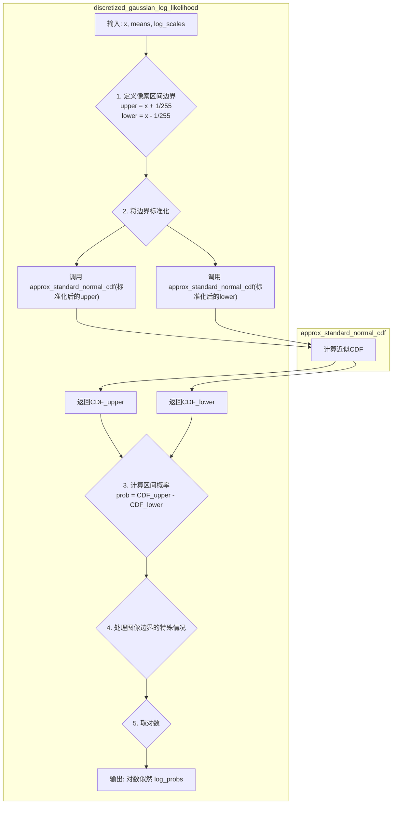

# _vb_terms_bpd
好的，我们来详细分析一下 [`_vb_terms_bpd`](guided_diffusion/gaussian_diffusion.py:773) 这个函数的作用。

### 核心作用

这个函数的核心作用是**计算变分下界（Variational Lower Bound, VLB）中的一个特定项**。在扩散模型的训练中，VLB是我们的优化目标（损失函数）。整个VLB损失是由多个时间步（timestep）的损失项相加得到的，而这个函数就是用来计算在单个时间步 `t` 上的损失。

计算结果的单位是**比特每维度（bits per dimension, bpd）**，这是一种标准化的度量，方便与其他论文中的结果进行公平比较。

---

### 工作流程详解

这个函数根据时间步 `t` 的不同，计算两种不同性质的损失：

1.  **当 `t > 0` 时：计算 KL 散度损失 (L<sub>t-1</sub>)**
    *   **目标**：让模型学习如何有效地“去噪”一步。
    *   **步骤**：
        1.  **计算“真实”的逆向分布**：首先，它调用 [`self.q_posterior_mean_variance`](guided_diffusion/gaussian_diffusion.py:531) 函数。这个函数利用原始图像 `x_start` 和当前噪声图像 `x_t`，计算出理论上完美的、从 `x_t` 回到 `x_{t-1}` 的后验分布 `q(x_{t-1} | x_t, x_0)` 的均值和方差。这可以看作是这一步去噪的“标准答案”。
        2.  **获取模型的预测分布**：然后，它调用 [`self.p_mean_variance`](guided_diffusion/gaussian_diffusion.py:693) 函数。这个函数利用神经网络 `model` 对当前的噪声图像 `x_t` 进行预测，得到模型认为的逆向分布 `p(x_{t-1} | x_t)` 的均值和方差。这是模型的“作答”。
        3.  **计算 KL 散度**：最后，它使用 [`normal_kl`](guided_diffusion/losses.py:8) 函数计算上述“标准答案”分布 `q` 和模型“作答”分布 `p` 之间的 KL 散度。KL 散度衡量了两个概率分布的相似程度。这个值越小，说明模型的预测越接近理想情况，去噪效果越好。这对应了论文中的 **L<sub>t-1</sub>** 损失项。

2.  **当 `t = 0` 时：计算负对数似然损失 (L<sub>0</sub>)**
    *   **目标**：衡量模型从最后一步噪声 `x_1` 生成的最终图像与原始图像 `x_0` 的相似度。
    *   **步骤**：
        1.  在 `t=0` 时，逆向过程的最后一步是从 `x_1` 生成 `x_0`。模型会预测出一个分布 `p(x_0 | x_1)`。
        2.  函数使用 [`discretized_gaussian_log_likelihood`](guided_diffusion/losses.py:23) 来计算原始图像 `x_start` 在这个模型预测分布下的负对数似然（Negative Log-Likelihood, NLL）。
        3.  这个 NLL 可以理解为一个**重建损失**。它衡量了模型最终生成的图像有多大的概率是原始图像。损失越小，说明重建的图像质量越高，与原图越像。这对应了论文中的 **L<sub>0</sub>** 损失项。


### `_vb_terms_bpd` 的输出是什么？

[`_vb_terms_bpd`](guided_diffusion/gaussian_diffusion.py:773) 函数的目的是计算变分下界（VLB）在单个时间步 `t` 上的损失项。它的输出是一个字典，我们关心的是键为 `"output"` 的值。

这个 `"output"` 的具体内容取决于输入的时间步 `t`：

*   **当 `t > 0` 时 (中间的去噪步骤):**
    *   `output` 是 **KL 散度**，即 `KL( q(x_{t-1} | x_t, x_0) || p(x_{t-1} | x_t) )`。
    *   它衡量了“理想的、一步到位的去噪分布 `q`”和“模型预测的去噪分布 `p`”之间的差异。这个值越小，说明模型这一步去噪学得越好。

*   **当 `t = 0` 时 (最后一步生成图像):**
    *   `output` 是**负对数似然 (Negative Log-Likelihood, NLL)**。
    *   它衡量了模型从 `x_1` 生成的最终图像与真实原始图像 `x_0` 的差距，可以理解为一个**重建损失**。

所以，在 `MSE` 模式下，当计算 `terms["vb"]` 时，我们实际上是在利用 VLB 损失中关于**两个概率分布（理想的 `q` 和模型的 `p`）匹配程度**的信息，来专门为模型的**方差预测**部分提供一个学习的梯度信号。


### 总结

简单来说，[`_vb_terms_bpd`](guided_diffusion/gaussian_diffusion.py:773) 函数是一个条件判断函数，它在整个去噪过程的不同阶段，计算不同类型的损失：

*   **对于中间的去噪步骤 (`t > 0`)**：它通过计算 KL 散度来确保模型每一步都学到了正确的去噪方向。
*   **对于最后一步生成图像 (`t = 0`)**：它通过计算负对数似然来确保模型最终生成的图像与原图足够相似。

在训练过程中，我们会对一批数据随机采样不同的时间步 `t`，然后调用这个函数计算对应 `t` 的损失，最后通过梯度下降来优化整个模型。

# discretized_gaussian_log_likelihood()

好的，我们来深入解析一下 [`discretized_gaussian_log_likelihood`](guided_diffusion/losses.py:78) 这个函数。

### 核心作用

这个函数的核心作用是**计算数据 `x` 在一个离散化高斯分布下的对数似然（log-likelihood）**。

简单来说，它回答了这样一个问题：“根据模型预测的均值（`means`）和方差（`log_scales`），我们观察到的真实数据 `x` 出现的概率有多大？” 这个概率值在机器学习中被称为“似然”。函数返回的是这个概率的对数，即“对数似然”。

在扩散模型的 L<sub>0</sub> 损失中，我们需要最大化这个似然（等价于最小化**负**对数似然），从而让模型生成的图像尽可能地接近真实图像。

---

### 为什么需要“离散化”？

*   **图像数据的本质**：数字图像的像素值是离散的。例如，一个8位灰度图像，其像素值只能是 `0, 1, 2, ..., 255` 这256个整数之一。即使我们将它归一化到 `[-1, 1]` 的连续区间，它本质上仍然代表着离散的强度等级。
*   **连续高斯分布的局限**：标准的高斯分布是一个连续概率分布，它为任何一个点 `x` 定义的是**概率密度（Probability Density）**，而不是**概率（Probability）**。一个连续变量取到某个精确值的概率是0。
*   **解决方案**：为了正确地为离-散数据建模，我们将每个像素值 `x` 不再看作一个点，而是看作一个小的区间（或称为“桶”，bin）的中心。这个区间的宽度对应于像素的一个量化步长。对于归一化到 `[-1, 1]` 的256级像素，每个区间的宽度是 `2 / 255`。因此，一个值 `x` 代表的是 `[x - 1/255, x + 1/255]` 这个区间。

这个函数计算的，就是真实数据 `x` 落在其对应区间内的概率。

### 工作流程详解

下面是该函数计算这个概率的详细步骤：

```mermaid
graph TD
    A[输入: 真实像素x, 预测均值means, 预测log方差log_scales] --> B{1. 计算数据点所在区间的边界};
    B --> C["上边界: centered_x + 1/255.0<br>下边界: centered_x - 1/255.0"];
    C --> D{2. 将边界转换到标准正态分布空间};
    D --> E["scaled_upper = inv_stdv * 上边界<br>scaled_lower = inv_stdv * 下边界"];
    E --> F{3. 计算边界的累积分布函数(CDF)};
    F --> G["cdf_plus = CDF(scaled_upper)<br>cdf_min = CDF(scaled_lower)"];
    G --> H{4. 计算区间概率};
    H --> I["中心区域概率 = cdf_plus - cdf_min"];
    G --> J{5. 处理图像边界的特殊情况};
    J --> K["x ≈ -1 (最暗): 概率 = cdf_plus<br>x ≈ 1 (最亮): 概率 = 1.0 - cdf_min"];
    I --> L{6. 整合所有情况并取对数};
    K --> L;
    L --> M[输出: 每个像素的对数似然 log_probs];

```

1.  **中心化与标准化**：
    *   `centered_x = x - means`：将数据 `x` 围绕模型预测的均值进行中心化。
    *   `inv_stdv = th.exp(-log_scales)`：计算标准差的倒数 `1/σ`。
    *   通过 `inv_stdv * ...` 操作，将问题从一个任意高斯分布转换到了标准正态分布（均值为0，方差为1），这样我们就可以使用标准正态分布的累积分布函数（CDF）来计算概率了。

2.  **定义离散区间的边界**：
    *   如前所述，每个像素值 `x` 代表一个宽度为 `2/255` 的区间。
    *   `plus_in` 和 `min_in` 分别计算了这个区间**上、下边界**在标准正态分布空间中的对应位置。

3.  **使用 CDF 计算区间概率**：
    *   一个变量落在区间 `[a, b]` 内的概率等于 `CDF(b) - CDF(a)`。
    *   `cdf_plus` 和 `cdf_min` 就是利用 `approx_standard_normal_cdf` 函数计算了上、下边界的累积概率。
    *   `cdf_delta = cdf_plus - cdf_min` 就是像素值 `x` 所在区间的概率。

4.  **处理边界情况（Edge Cases）**：
    *   当 `x` 非常接近 `-1` 时（例如 `x < -0.999`），它代表的是最左边的那个“桶”。这个桶的范围应该是从 `-∞` 到 `x + 1/255`。因此，它的概率直接就是 `cdf_plus`。
    *   同理，当 `x` 非常接近 `1` 时（例如 `x > 0.999`），它代表最右边的桶，范围是从 `x - 1/255` 到 `+∞`。它的概率是 `1.0 - cdf_min`。
    *   对于所有中间的像素值，概率就是 `cdf_delta`。
    *   代码中的 `th.where` 语句就是用来优雅地处理这三种情况的。

5.  **返回对数似然**：
    *   最后，函数对计算出的概率取对数，并返回。在计算对数前使用 `.clamp(min=1e-12)` 是为了防止 `log(0)` 导致的数值计算问题。

### 总结

[`discretized_gaussian_log_likelihood`](guided_diffusion/losses.py:78) 是一个精确计算离散数据（如图像像素）在高斯模型下似然值的关键函数。它通过将每个数据点视为一个小区间，并利用累积分布函数（CDF）来计算其概率，从而比直接使用概率密度函数（PDF）更加准确地对离散数据进行建模。这是计算扩散模型 L<sub>0</sub> 重建损失的标准方法。


# approx_standard_normal_cdf()和discretized_gaussian_log_likelihood()


好的，我们来一起讲解这两个函数，理解它们是如何协同工作的。

这两个函数共同解决了一个核心问题：**如何为一个由离散像素值构成的真实图像，计算其在模型预测的连续高斯分布下的生成概率（即似然）**。

---

### 1. `approx_standard_normal_cdf(x)`: 数学工具

*   **作用**: 这个函数是一个**数学辅助函数**，它的全称是“标准正态分布累积分布函数（CDF）的近似”。
*   **什么是CDF?**: 对于一个概率分布，它的CDF(x)表示“变量的值小于或等于x的概率”。CDF的值域总是在 `[0, 1]` 之间。
*   **为什么需要“近似”?**: 标准正态分布的真实CDF没有一个简单的初等函数表达式（它需要用到特殊函数，如误差函数`erf`），直接计算会比较慢。因此，在深度学习中，通常会使用一个计算速度快且精度足够高的近似公式。
*   **它做了什么?**: 这个函数就实现了这样一个广为接受的、基于 `tanh` 函数的近似公式。输入一个值 `x`，它能快速返回一个接近真实标准正态CDF(x)的值。

**简单来说，`approx_standard_normal_cdf` 是一个高效的数学工具，用来快速查询“在一个标准正态分布中，随机变量小于等于x的概率是多少”。**

---

### 2. `discretized_gaussian_log_likelihood(...)`: 核心逻辑

*   **作用**: 这是**核心的损失计算函数**。它的目标是计算真实图像 `x` 在模型预测的高斯分布下的**离散化对数似然**。
*   **核心思想**: 正如我们之前讨论的，图像像素是离散的，而模型预测的是连续的高斯分布。我们不能直接计算一个点在连续分布下的概率（因为是0）。所以，我们将每个像素值 `x` 看作是代表了一个小区间 `[x - 1/255, x + 1/255]`。这个函数计算的就是，模型预测的高斯分布，其变量落入这个区间的概率是多少。
*   **如何与 `approx_standard_normal_cdf` 协同工作**:
    一个变量落在区间 `[a, b]` 内的概率等于 `CDF(b) - CDF(a)`。这正是这两个函数协同的关键点。



**工作流程**:

1.  `discretized_gaussian_log_likelihood` 接收真实图像 `x` 和模型预测的分布参数 `means` 和 `log_scales`。
2.  对于 `x` 中的每一个像素，它定义了其所代表的区间的上、下边界。
3.  它将这些边界值进行标准化（减去均值，除以标准差），将其转换到标准正态分布的空间。
4.  **然后，它调用 `approx_standard_normal_cdf` 这个工具函数**，分别计算标准化后的上、下边界的累积概率 `cdf_plus` 和 `cdf_min`。
5.  它用 `cdf_plus - cdf_min` 得到每个像素所在区间的概率。
6.  在处理完图像两端的边界情况后，它对最终的概率取对数，得到对数似然。

### 总结

这两个函数的关系是**“使用者”与“工具”**的关系：

*   [`approx_standard_normal_cdf`](guided_diffusion/losses.py:58) 是一个基础的**数学工具**，它提供了一个高效计算标准正态分布CDF近似值的方法。
*   [`discretized_gaussian_log_likelihood`](guided_diffusion/losses.py:65) 是一个**核心逻辑函数**，它负责实现为离散图像数据计算对数似然的整个流程。在这个流程中，它**调用**了 `approx_standard_normal_cdf` 来完成关键的概率计算步骤。

它们共同构成了计算扩散模型 L<sub>0</sub> 重建损失的完整方案。