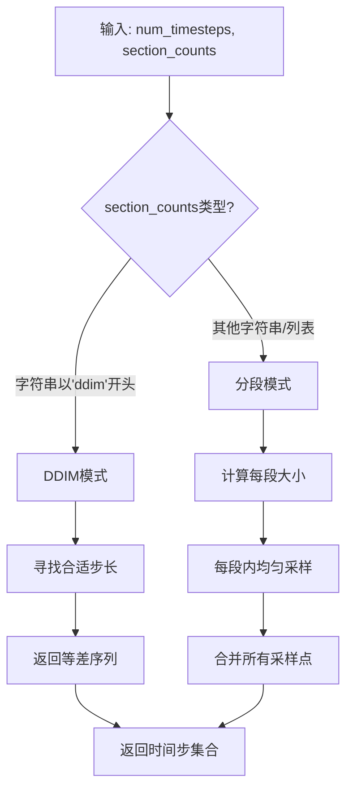
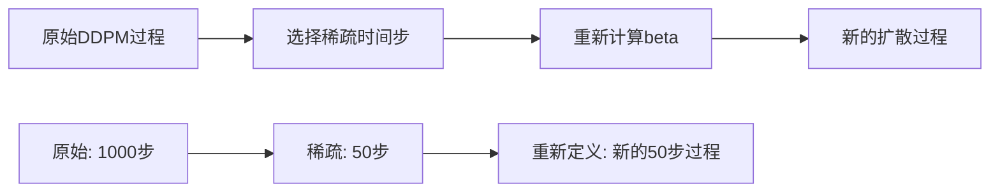

# Claude

## `respace.py`作用

我来详细讲解一下 [`guided_diffusion/respace.py`](guided_diffusion/respace.py) 这个代码文件的作用。

### 文件概述

这个文件实现了扩散模型中的**时间步重采样（Resampling）**功能，主要用于加速扩散模型的采样过程。它允许我们从完整的扩散时间步中选择一个稀疏的子集，从而在保持生成质量的同时显著减少计算量。

### 核心组件

#### 1. [`space_timesteps()`](guided_diffusion/respace.py:7) 函数

这是整个文件的核心函数，负责从原始的时间步中创建一个稀疏的采样序列。

**主要功能：**

- 支持两种采样模式：
  - **DDIM模式**：使用固定的步长进行均匀采样
  - **分段模式**：将时间步分成多个段，每段内进行不同密度的采样

**工作原理：**



**示例：**

- 原始1000步，`section_counts=[10, 20, 30]`
- 分成3段：0-332步采样10个，333-665步采样20个，666-999步采样30个
- 总采样步数：60步（相比1000步大幅减少）

### 2. [`SpacedDiffusion`](guided_diffusion/respace.py:82) 类

这个类继承自 [`GaussianDiffusion`](guided_diffusion/gaussian_diffusion.py)，实现了稀疏时间步的扩散过程。

**核心创新：**

- **重新计算beta参数**：基于保留的时间步重新计算扩散参数
- **时间步映射**：维护新旧时间步之间的映射关系
- **模型包装**：自动处理时间步的转换

**关键算法：**

```python
# 重新计算beta的公式
new_beta_t = 1 - alpha_cumprod_t / alpha_cumprod_{t-1}
```

这个公式确保了即使在稀疏的时间步上，扩散过程的数学性质仍然保持一致。

#### 3. [`_WrappedModel`](guided_diffusion/respace.py:172) 类

这是一个包装器类，负责将稀疏的时间步索引映射回原始的时间步索引。

**主要功能：**

- **索引映射**：将新的连续时间步（0,1,2,...）映射回原始的稀疏时间步
- **时间步缩放**：根据需要将时间步缩放到模型期望的范围
- **批量处理**：支持高效的批量索引操作

### 实际应用场景

#### 1. **加速采样**

```python
# 原始：1000步采样
# 使用respace：50步采样，速度提升20倍
use_timesteps = space_timesteps(1000, "ddim50")
spaced_diffusion = SpacedDiffusion(use_timesteps, **kwargs)
```

#### 2. **渐进式采样**

```python
# 早期阶段密集采样，后期阶段稀疏采样
use_timesteps = space_timesteps(1000, [100, 50, 20, 10])
```

#### 3. **DDIM采样**

```python
# DDIM需要特定的步长模式
use_timesteps = space_timesteps(1000, "ddim25")
```

### 数学原理

这个文件的核心数学思想是**扩散过程的等价性**：

1. **保持alpha_cumprod关系**：通过重新计算beta，确保保留时间步的累积乘积与原始过程一致
2. **时间步重参数化**：将连续的扩散过程重新参数化为离散的采样步骤
3. **方差保持**：确保重采样后的过程保持相同的噪声分布特性

### 与其他模块的关系

- **依赖**：[`gaussian_diffusion.py`](guided_diffusion/gaussian_diffusion.py) - 提供基础扩散过程
- **被使用**：采样脚本中用于创建加速的扩散过程
- **配合**：与DDIM等快速采样方法配合使用

### 总结

[`respace.py`](guided_diffusion/respace.py) 是扩散模型中一个非常重要的优化模块，它通过智能的时间步重采样，在保持生成质量的前提下大幅提升了采样效率。这个实现既考虑了数学上的正确性，又兼顾了实际应用中的性能需求，是扩散模型工程化应用的关键技术之一。

## 稀疏采样不是还是使用原来的DDPM模型吗，为什么还需要SpacedDiffusion 类来实现稀疏扩散过程。

这是一个非常好的问题！让我详细解释为什么需要 `SpacedDiffusion` 类，而不是直接使用原来的DDPM模型。

## 核心问题：扩散过程的数学一致性

### 1. **DDPM模型的假设**

原始的DDPM模型训练时假设：

- 时间步是连续的：t = 0, 1, 2, ..., T-1
- 每一步都有对应的 `beta_t` 和 `alpha_cumprod_t`
- 模型学习的是 `p(x_{t-1} | x_t, t)` 这个条件分布

### 2. **稀疏采样的挑战**

如果我们直接跳过某些时间步，比如从1000步跳到50步：

```python
# 原始时间步：[0, 1, 2, 3, ..., 999]
# 稀疏时间步：[0, 20, 40, 60, ..., 980]  # 每20步取一个
```

**问题出现：**

- 模型期望输入时间步 `t=20` 时，应该知道从 `x_20` 预测 `x_19`
- 但我们实际想从 `x_20` 直接跳到 `x_0`
- 这破坏了DDPM的数学假设！

## 为什么需要 SpacedDiffusion

### 1. **重新定义扩散过程**

`SpacedDiffusion` 的核心思想是：**创建一个新的、数学上自洽的扩散过程**



### 2. **数学原理**

让我们看看具体的数学推导：

**原始DDPM：**

```
x_t = sqrt(alpha_cumprod_t) * x_0 + sqrt(1 - alpha_cumprod_t) * ε
```

**稀疏采样的问题：**
如果我们直接跳步，比如从 `t=0` 跳到 `t=20`：

```
x_20 = sqrt(alpha_cumprod_20) * x_0 + sqrt(1 - alpha_cumprod_20) * ε
```

但模型训练时学习的是 `p(x_19 | x_20)`，不是 `p(x_0 | x_20)`

**SpacedDiffusion的解决方案：**
重新定义一个新的扩散过程，让稀疏的时间步变成"连续的"：

```python
# 新的第0步 = 原始的第0步
# 新的第1步 = 原始的第20步  
# 新的第2步 = 原始的第40步
# ...

# 重新计算新的beta：
new_beta_1 = 1 - alpha_cumprod_20 / alpha_cumprod_0
new_beta_2 = 1 - alpha_cumprod_40 / alpha_cumprod_20
```

### 3. **具体例子**

假设原始1000步，我们选择 `[0, 250, 500, 750, 999]` 这5个时间步：

```python
# 原始alpha_cumprod: [α₀, α₂₅₀, α₅₀₀, α₇₅₀, α₉₉₉]

# SpacedDiffusion重新计算：
new_beta_0 = 1 - α₀ / 1.0                    # 从x_0到x_-1
new_beta_1 = 1 - α₂₅₀ / α₀                   # 从x_250到x_0  
new_beta_2 = 1 - α₅₀₀ / α₂₅₀                 # 从x_500到x_250
new_beta_3 = 1 - α₇₅₀ / α₅₀₀                 # 从x_750到x_500
new_beta_4 = 1 - α₉₉₉ / α₇₅₀                 # 从x_999到x_750
```

这样，新的扩散过程就变成了一个**数学上自洽的5步扩散过程**！

## 关键代码分析

### 1. **重新计算beta的核心逻辑**

看第114-118行的关键代码：

```python
new_betas.append(1 - alpha_cumprod / last_alpha_cumprod)
```

这个公式的含义是：

- `alpha_cumprod`：当前保留时间步的累积乘积
- `last_alpha_cumprod`：上一个保留时间步的累积乘积
- `new_beta`：新的扩散过程中相邻"保留步"之间的beta值

**数学推导：**

```
原始：α_cumprod_t = (1-β_t) × α_cumprod_{t-1}
变形：β_t = 1 - α_cumprod_t / α_cumprod_{t-1}

在稀疏过程中：
new_β_i = 1 - α_cumprod_{保留步i} / α_cumprod_{保留步i-1}
```

### 2. **时间步映射机制**

看第182-208行的 `_WrappedModel`：

```python
def __call__(self, x, ts, **kwargs):
    # ts 是新的连续时间步 [0, 1, 2, ..., 49]
    map_tensor = th.tensor(self.timestep_map, device=ts.device, dtype=ts.dtype)
    # timestep_map = [0, 20, 40, 60, ..., 980] (原始时间步)
    new_ts = map_tensor[ts]  # 映射回原始时间步
    return self.model(x, new_ts, **kwargs)
```

**映射过程：**

```
新时间步 t'=0 → 原始时间步 t=0
新时间步 t'=1 → 原始时间步 t=20  
新时间步 t'=2 → 原始时间步 t=40
...
新时间步 t'=49 → 原始时间步 t=980
```

## 具体例子说明

假设原始1000步，我们选择 `[0, 250, 500, 750, 999]`：

### 1. **原始DDPM的问题**

```python
# 模型训练时学习：
p(x_249 | x_250, t=250)  # 相邻步
p(x_499 | x_500, t=500)  # 相邻步

# 稀疏采样时需要：
p(x_0 | x_250, t=250)     # 跳跃步！模型没学过
p(x_250 | x_500, t=500)  # 跳跃步！模型没学过
```

### 2. **SpacedDiffusion的解决方案**

```python
# 重新计算新的beta：
new_beta_0 = 1 - α_0 / 1.0           # 从x_0到噪声
new_beta_1 = 1 - α_250 / α_0         # 从x_250到x_0
new_beta_2 = 1 - α_500 / α_250       # 从x_500到x_250
new_beta_3 = 1 - α_750 / α_500       # 从x_750到x_500
new_beta_4 = 1 - α_999 / α_750       # 从x_999到x_750

# 新的扩散过程学习：
p(x_0 | x_250, t'=1)    # 现在是"相邻步"了！
p(x_250 | x_500, t'=2)  # 现在是"相邻步"了！
```

## 为什么不能直接跳步？

### 1. **数学不一致**

直接跳步破坏了马尔可夫性质：

```
原始：x_t → x_{t-1} → x_{t-2} → ... → x_0
跳步：x_t → x_0  (中间步骤被跳过)
```

### 2. **分布不匹配**

模型学习的是 `p(x_{t-1} | x_t)`，但我们需要 `p(x_0 | x_t)`，这两个分布完全不同。

### 3. **方差计算错误**

直接跳步会导致噪声方差的计算错误，影响生成质量。

## 总结

`SpacedDiffusion` 的必要性在于：

1. **保持数学一致性**：重新定义扩散过程，使稀疏采样在数学上是自洽的
2. **适配模型训练**：让模型仍然处理"相邻时间步"的关系，只是重新定义了什么是"相邻"
3. **保证生成质量**：通过正确的beta重计算，确保噪声分布的正确性
4. **透明的时间步映射**：通过 `_WrappedModel` 自动处理新旧时间步的转换

**核心思想：** 不是简单地跳过步骤，而是创建一个新的、步数更少但数学等价的扩散过程。
