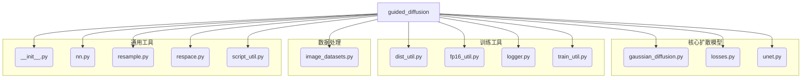

`guided_diffusion` 项目是一个用于实现引导扩散模型的 Python 库。其结构清晰，将不同的功能模块化，便于开发和维护。以下是主要文件及其作用的解释：

1. **[`__init__.py`](guided_diffusion/__init__.py)**:  Python 包初始化文件，用于将 `guided_diffusion` 目录标识为一个 Python 包。
2. **[`dist_util.py`](guided_diffusion/dist_util.py)**: 包含用于分布式训练的实用工具函数，例如在多 GPU 环境下设置和管理训练过程。
3. **[`fp16_util.py`](guided_diffusion/fp16_util.py)**: 提供混合精度（FP16）训练的实用工具，这有助于提高训练速度并减少内存占用。
4. **[`gaussian_diffusion.py`](guided_diffusion/gaussian_diffusion.py)**: 这是扩散模型的核心实现。它定义了高斯扩散过程（前向过程）和逆扩散过程（反向去噪过程），包括噪声调度和采样逻辑。
5. **[`image_datasets.py`](guided_diffusion/image_datasets.py)**: 负责加载、预处理和增强图像数据集，通常会创建 PyTorch 的 `Dataset` 和 `DataLoader` 对象。
6. **[`logger.py`](guided_diffusion/logger.py)**: 用于记录训练过程中的各种信息，如损失值、评估指标，以及保存生成的图像等。
7. **[`losses.py`](guided_diffusion/losses.py)**: 定义了扩散模型训练中使用的损失函数，例如去噪损失（L1/L2 损失）或感知损失。
8. **[`nn.py`](guided_diffusion/nn.py)**: 包含神经网络相关的通用工具函数或自定义层，这些组件可能被 `unet.py` 用于构建 U-Net 模型。
9. **[`resample.py`](guided_diffusion/resample.py)**: 可能包含用于图像重采样（如上采样或下采样）的函数，这在 U-Net 架构中是常见的操作。
10. **[`respace.py`](guided_diffusion/respace.py)**: 可能与扩散过程中的时间步长或采样步长的调整有关，旨在优化采样效率或生成质量。
11. **[`script_util.py`](guided_diffusion/script_util.py)**: 提供了命令行脚本的实用工具函数，例如解析命令行参数、设置模型和扩散参数。`scripts/` 目录下的训练和采样脚本会调用此模块。
12. **[`train_util.py`](guided_diffusion/train_util.py)**: 包含了训练循环、优化器配置、学习率调度等训练相关的实用工具函数。
13. **[`unet.py`](guided_diffusion/unet.py)**: 实现了 U-Net 神经网络架构，这是扩散模型中常用的去噪网络。

**项目整体流程概览:**

* **数据处理**: [`image_datasets.py`](guided_diffusion/image_datasets.py) 负责数据的输入。
* **模型构建**: [`unet.py`](guided_diffusion/unet.py) 和 [`nn.py`](guided_diffusion/nn.py) 定义了模型的架构。
* **核心算法**: [`gaussian_diffusion.py`](guided_diffusion/gaussian_diffusion.py) 实现了扩散模型的核心逻辑。
* **训练优化**: [`losses.py`](guided_diffusion/losses.py)、[`train_util.py`](guided_diffusion/train_util.py)、[`fp16_util.py`](guided_diffusion/fp16_util.py) 和 [`dist_util.py`](guided_diffusion/dist_util.py) 共同支持模型的训练过程。
* **辅助功能**: [`script_util.py`](guided_diffusion/script_util.py) 和 [`logger.py`](guided_diffusion/logger.py) 提供命令行接口和日志记录功能。
* **采样机制**: [`resample.py`](guided_diffusion/resample.py) 和 [`respace.py`](guided_diffusion/respace.py) 可能用于生成过程中的细节控制。

以下是 `guided_diffusion` 项目结构的 Mermaid 图示：

